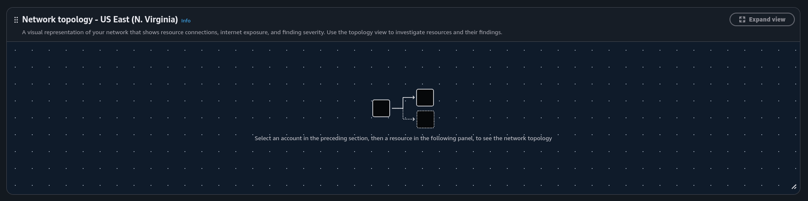
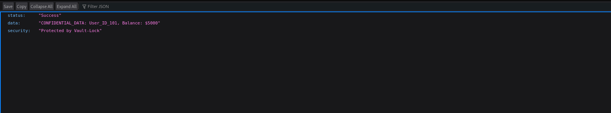
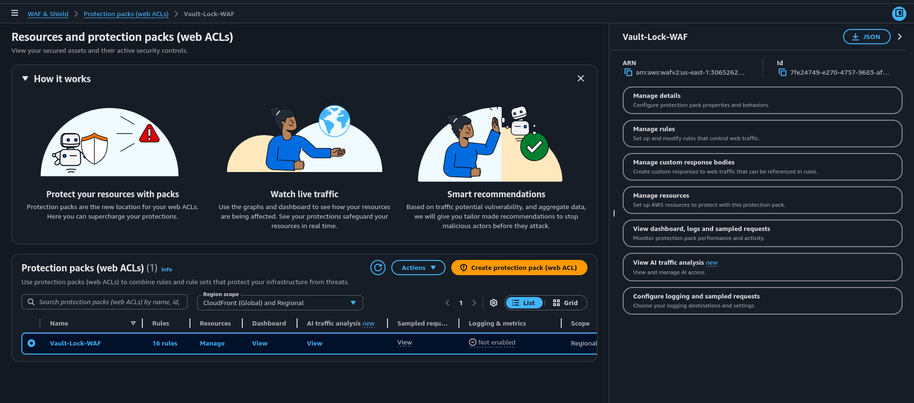
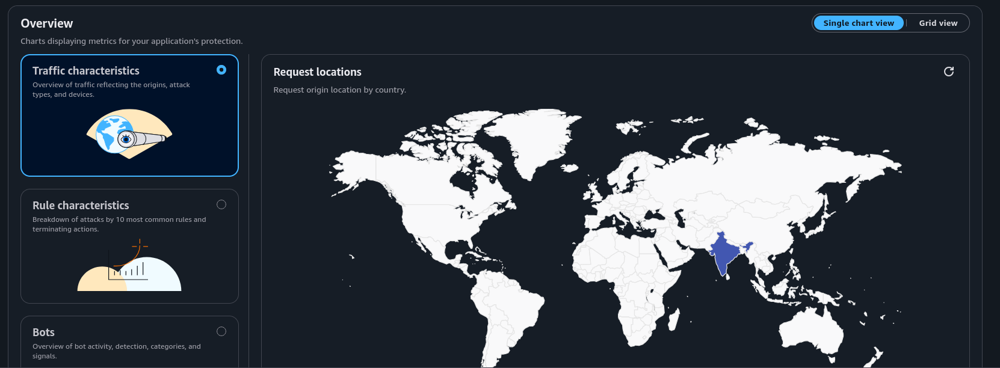

# CloudShield: AWS WAF SQLi Mitigation & Infrastructure Hardening

## 📌 Project Overview
This project demonstrates the end-to-end identification and mitigation of **SQL Injection (SQLi)** vulnerabilities within a serverless AWS infrastructure. By architecting a **Defense-in-Depth** strategy using **AWS WAF (Web Application Firewall)**, I successfully secured an API Gateway and backend Lambda functions, neutralizing OWASP Top 10 threats and preventing unauthorized data exfiltration.

---

## 🏗️ 1. Infrastructure Architecture
Visualizing the security layers and request flow within the AWS Cloud environment.

> **Technical Detail:** This topology illustrates the secure request lifecycle. The AWS WAF is positioned at the edge as the primary inspector, validating all incoming traffic before it reaches the API Gateway and downstream compute layers (AWS Lambda).

---

## 🔓 2. Vulnerability Assessment (Pre-Mitigation)
Demonstrating the critical security gap in an unprotected REST API.

> **Technical Detail:** Before implementing security controls, the system was vulnerable to a standard SQLi payload (`' OR '1'='1`). This Proof-of-Concept (PoC) shows the API leaking sensitive database information, including `User_ID_101` and `Balance: $5000`.

---

## ⚙️ 3. Security Implementation (WAF Configuration)
Enforcing granular traffic filtering and customized managed rule sets.

> **Technical Detail:** I deployed the **AWSManagedRulesSQLiRuleSet** and configured the action to **"Block"**. To ensure comprehensive coverage, I enabled deep packet inspection across Query Arguments, HTTP Body, and Cookies, effectively closing common bypass vectors.

---

## ✅ 4. Attack Mitigation Validation (The Result)
Verifying the efficacy of the implemented security controls through active testing.

> **Technical Detail:** Post-hardening validation shows that the same attack vector is now successfully intercepted. The WAF terminates the malicious session at the edge, returning a definitive **HTTP 403 Forbidden** status.

---

## 📝 5. Terminal Execution Logs (PoC)
Verbose terminal analysis capturing the handshake and mitigation response.

> **Technical Detail:** This execution log captures the raw `curl` verbose output. It verifies the complete **TLS 1.3 handshake** and confirms the server-side rejection with a `{"message":"Forbidden"}` JSON response, providing low-level proof of the mitigation success.

---

## 📊 6. Real-Time Observability & Monitoring
Leveraging cloud-native analytics for threat intelligence and traffic monitoring.

> **Technical Detail:** The CloudWatch dashboard provides real-time visibility into attack telemetry. The visible spikes represent blocked requests, with automated logging tagging the **SQLiRuleSet** as the specific trigger for termination.

---

## 🛠️ Technical Stack & Tooling
A comprehensive list of industry-standard technologies utilized in this project:

* **Cloud Infrastructure (AWS):**
    * **AWS WAF:** Edge security for request filtering and threat mitigation.
    * **Amazon API Gateway:** Managed entry point for serverless logic.
    * **AWS Lambda:** Serverless compute for backend API processing.
    * **Amazon CloudWatch:** Real-time observability, logging, and metrics.
* **Security & Penetration Testing:**
    * **Kali Linux:** Primary environment for vulnerability assessment and attack simulation.
    * **cURL:** Command-line utility for crafting and sending malicious test payloads.
* **Protocols & Standards:**
    * **OWASP Top 10:** Framework used to address high-priority web vulnerabilities.
    * **TLS 1.3 & HTTP/2:** Advanced protocols enforced for secure data transit.
    * **Zero-Trust Logic:** Ensuring every request is inspected and validated before processing.

---

### 🚀 Deployment Instructions:
1.  **Repository Setup:** Upload all 5 screenshots and the log file (`Final.output22`) to the root directory of your GitHub repository.
2.  **README Update:** Open the `README.md` editor and paste the Markdown code above.
3.  **Verification:** Ensure that file names in the repository exactly match the links in the Markdown code (e.g., `network_topology.png`) for the images to render correctly.
